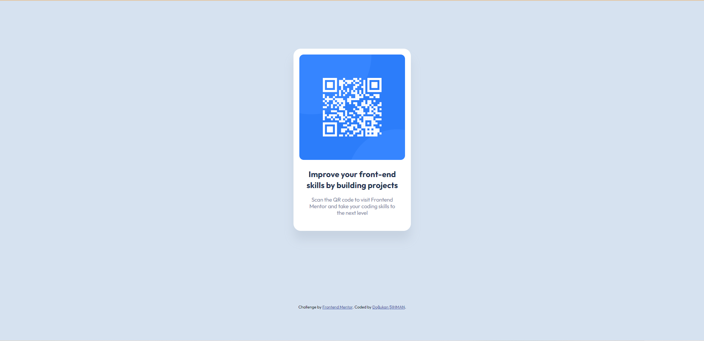

# Frontend Mentor - QR code component solution

This is a solution to the [QR code component challenge on Frontend Mentor](https://www.frontendmentor.io/challenges/qr-code-component-iux_sIO_H). Frontend Mentor challenges help you improve your coding skills by building realistic projects.

## Table of contents

- [Overview](#overview)
  - [Screenshot](#screenshot)
  - [Links](#links)
- [My process](#my-process)
  - [Built with](#built-with)
  - [What I learned](#what-i-learned)
- [Author](#author)
- [Acknowledgments](#acknowledgments)

## Overview

### Screenshot

### Links

- Solution URL: [Add solution URL here](https://your-solution-url.com)
- Live Site URL: [Add live site URL here](https://your-live-site-url.com)

## My process

### Built with

- Semantic HTML5 markup
- CSS custom properties
- Flexbox
- CSS Grid

### What I learned

I've learned how to center items on HTML document using CSS.

## Author

- Website - [Doğukan ŞIHMAN](https://dogukansportfolio.w3spaces.com/)
- Frontend Mentor - [@dogukan0055](https://www.frontendmentor.io/profile/dogukan0055)
- Twitter - [@bedavatekme](https://www.twitter.com/bedavatekme)

## Acknowledgments

I've watched a few YouTube tutorials, they gave me some inspriation. But to be honest, this challange was the easiest one. I just wanna make sure I didn't miss anything.
